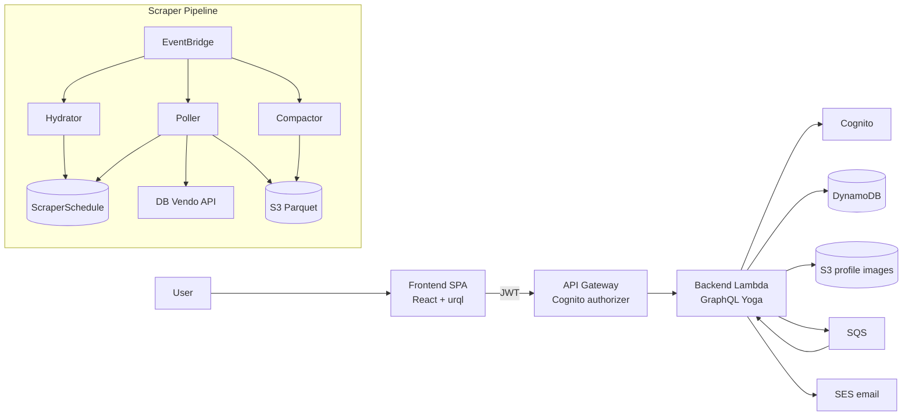

# Project Overview

Train Price Monitor is a serverless web app that tracks Deutsche Bahn ticket prices and notifies
users when a monitored journey rises above a chosen threshold. It pairs a React 19 + Material-UI
frontend with a GraphQL Yoga backend on AWS Lambda, and a standalone scraper pipeline that records
historical fare data to Parquet on S3. Everything is defined as code with AWS CDK v2 and orchestrated
through a `mise` monorepo.

## Repository Structure

- `frontend/` – React 19 SPA (Material-UI v7, urql, Vite); pages, components, hooks, providers.
- `backend/` – GraphQL Yoga API with a native AWS Lambda handler (API Gateway v1/v2 + SQS).
- `scraper/` – Independent serverless pipeline collecting DB price data into Parquet on S3.
- `infrastructure/` – AWS CDK v2 stacks (`lib/`), CDK app entry (`bin/`), CDK tests (`test/`).
- `.mise.toml` / `mise.tasks.toml` – Monorepo task definitions shared across modules.
- `eslint.config.cjs` – Shared ESLint v10 flat config.
- `docker-compose.yml` – Local dev services (Floci AWS emulator, backend, frontend).

Each module owns a `mise.toml` whose tasks are reachable as `mise run //module:task`.

## Build & Development Commands

Install tooling once with `mise install`. Per-module commands:

```bash
# Frontend (Vite + React 19)
cd frontend
npm install            # Install dependencies
npm run dev            # Start Vite dev server (port 3000)
npm run build          # Production build to frontend/build
npm test               # Run Vitest tests
npm run typecheck      # TypeScript check
npm run lint           # ESLint check
```

```bash
# Backend (GraphQL Yoga)
cd backend
npm install            # Install dependencies
LOCAL_DEV=1 npm run dev  # Start local HTTP server with hot reload (port 4000)
npm run build          # Bundle with esbuild to backend/dist
npm run codegen        # Generate GraphQL types from schema
npm run typecheck      # TypeScript check
npm run lint           # ESLint check
```

```bash
# Scraper (esbuild → 3 Lambda bundles)
cd scraper
npm install            # Install dependencies
npm run build          # Bundle to scraper/dist/{poller,hydrator,compactor}
npm run typecheck      # TypeScript check
npm run lint           # ESLint check
```

```bash
# Infrastructure (CDK)
cd infrastructure
npm install            # Install dependencies
npm run build          # Compile TypeScript
npm run test           # Run Jest tests
npm run cdk deploy     # Deploy to AWS
npm run cdk diff       # Show diff against deployed stack
npm run typecheck      # TypeScript check
npm run lint           # ESLint check
```

```bash
# Monorepo (mise) — run from any directory
npx pre-commit run --all-files     # Run all pre-commit hooks
mise run //...:build               # Build all modules in parallel
mise run //...:test                # Run tests across all modules
mise run //...:lint                # Lint all modules
mise run //frontend:dev            # Start frontend dev server
mise run //backend:dev             # Start backend local server (sets LOCAL_DEV=1)
mise run //infrastructure:deploy   # Deploy all CDK stacks
```

> `LOCAL_DEV=1` switches the backend entry point from a Lambda handler to a plain HTTP server.
> The `mise run //backend:dev` task sets it automatically.

## Code Style & Conventions

- **TypeScript strict mode** in all modules; explicit param/return types; prefer `interface` for
  object shapes; use `unknown` over `any`.
- Use `const` by default; `let` only when reassignment is needed.
- **No `console.log`** anywhere (`no-console: error`). Backend and scraper log via
  `@aws-lambda-powertools/logger`.
- **Prettier**: `{ "trailingComma": "es5", "tabWidth": 2, "printWidth": 120, "useTabs": false,
"semi": true, "singleQuote": true }`.
- **ESLint** v10 flat config (`eslint.config.cjs`) with `@typescript-eslint` recommended rules.
- **Imports**: external packages first (alphabetical), then internal relative paths, grouped by a
  blank line.
- **Naming**: Components PascalCase; hooks `useX`; utilities/API camelCase; classes/stacks PascalCase;
  constants SCREAMING_SNAKE_CASE; files kebab-case.
- **React**: functional components with hooks; named exports for reusable components, default exports
  for pages; props interface named `<Component>Props`, destructured in the signature.
- **CDK**: extend `cdk.Stack`; descriptive construct IDs; prefer L2 constructs; accept
  `props?: cdk.StackProps`.
- **Commits**: short imperative subject (e.g. `Add price alert threshold validation`); pre-commit
  hooks must pass before committing.

## Architecture Notes



- **Frontend** authenticates via Cognito and calls the GraphQL API; the urql client attaches the JWT.
- **Backend** is a single Lambda serving GraphQL over API Gateway and consuming SQS for journey
  monitor updates; it reads DB journey data via `db-vendo-client` and sends email via SES.
- **Scraper** is fully decoupled: EventBridge schedules drive the Hydrator (seed targets), Poller
  (scrape prices), and Compactor (consolidate Parquet). See `scraper/README.md` for details.

## Testing Strategy

- **Frontend** – Vitest (`*.test.{ts,tsx}`); run `mise run //frontend:test` (or `npm test`).
- **Infrastructure** – Jest with ts-jest (`*.test.ts`); run `mise run //infrastructure:test`.
  Use descriptive names, e.g. `test('SQS Queue Created')`.
- **Scraper / Backend** – No automated test suites yet; rely on `typecheck` + `lint`.
  > TODO: add unit coverage for scraper TTD tiering and Parquet serialization.
- **CI** – `mise run //...:test` and `mise run //...:lint` run all modules; `pre-commit` enforces
  formatting and linting on every commit.

## Security & Compliance

- Never commit `.env` files or secrets; secrets are injected by CDK at deploy time.
- API Gateway uses a Cognito authorizer — all GraphQL requests need a valid JWT (handled by the
  frontend urql client).
- IAM follows least privilege; the scraper grants only the table/bucket access each Lambda needs.
- Pre-commit hooks enforce: trailing-whitespace, LF line endings, valid YAML/JSON, Prettier, ESLint.
  Install with `pip install pre-commit && pre-commit install`.
- Licensed under GPL-3.0.
  > TODO: document dependency-scanning tooling (e.g. Dependabot / npm audit) if/when adopted.

## Agent Guardrails

- Never edit generated or vendored files: `**/dist/`, `**/node_modules/`, `**/cdk.out/`,
  GraphQL codegen output, and `package-lock.json` (change deps via `npm install`).
- Do not commit `.env` or any credentials; do not weaken the Cognito authorizer.
- Respect esbuild bundling rules below — wrong `--external` flags crash Lambdas at runtime.
- Infra changes: run `npm run build` and `npm run cdk diff` before any deploy; never `cdk deploy`
  without a human reviewing the diff.
- Keep `no-console` clean; use the powertools logger in backend/scraper.

**Backend esbuild bundling** (`--format=cjs`):

- Do NOT externalize ESM-only packages — they cannot be `require()`d and crash Lambda with
  `UserCodeSyntaxError` (API Gateway then returns a 502, often misreported as CORS).
- `db-vendo-client` must be **bundled** (ESM-only).
- `db-hafas-stations` must stay **external** (uses `import.meta.url`, loaded via dynamic `import()`).

**Scraper esbuild bundling** (`--format=esm`):

- AWS SDK packages are externalized (provided by the Node.js 24 runtime).
- The poller bundle needs a CJS `require()` shim banner for CJS-only transitive deps
  (`qs` → `object-inspect` calling `require('util')`).

## Extensibility Hooks

Environment variables (never commit values):

| Variable                     | Module           | Description                                             |
| ---------------------------- | ---------------- | ------------------------------------------------------- |
| `PROFILE_IMAGE_BUCKET_NAME`  | Backend          | S3 bucket name for profile images                       |
| `TPM_SQS_QUEUE_URL`          | Backend          | SQS queue URL for journey monitor updates               |
| `SES_FROM_EMAIL`             | Backend (Lambda) | Sender address for SES emails (injected by CDK)         |
| `FRONTEND_URL`               | Backend (Lambda) | Frontend base URL for notification links                |
| `LOCAL_DEV`                  | Backend          | `1` starts an HTTP server instead of the Lambda handler |
| `PORT`                       | Backend          | HTTP port for local dev server (default `4000`)         |
| `REACT_APP_GRAPHQL_ENDPOINT` | Frontend         | API Gateway base URL                                    |
| `CDK_APP_NAME`               | Infrastructure   | Application name (overrides CDK context)                |
| `CDK_DOMAIN_NAME`            | Infrastructure   | Custom domain name for the deployment                   |
| `CDK_SES_FROM_EMAIL`         | Infrastructure   | Sender email injected as Lambda `SES_FROM_EMAIL`        |
| `SCRAPER_TABLE_NAME`         | Scraper          | DynamoDB schedule table (injected by CDK)               |
| `SCRAPER_BUCKET_NAME`        | Scraper          | S3 bucket for Parquet data (injected by CDK)            |
| `HYDRATOR_LOOKAHEAD_DAYS`    | Scraper          | Days ahead to seed (default `90`)                       |
| `AWS_ENDPOINT_URL`           | Scraper          | Local Floci endpoint (set by mise tasks)                |

- Add CDK stacks under `infrastructure/lib/` and wire them in `infrastructure/bin/`.
- Extend scrape coverage by editing `scraper/stations.json` (route catalog is auto-generated).
- New GraphQL resolvers: edit the schema, run `npm run codegen`, then implement the resolver.

## Further Reading

- [scraper/README.md](scraper/README.md) – Scraper architecture, Parquet schema, local Floci dev.
- [infrastructure/README.md](infrastructure/README.md) – CDK stacks and mise deploy tasks.
- [README.md](README.md) – Product overview, getting started, usage.
- `CDK_APP_NAME`, `CDK_DOMAIN_NAME`, `CDK_SES_FROM_EMAIL` must be set before `cdk deploy`
  (env vars or `-c` context); missing values fail at synth time.
- Backend log group: `/aws/lambda/InfrastructureStack-BackendGraphql*`.
  Scraper log groups: `/aws/lambda/ScraperStack-Scraper*`. Docker Lambda cold start is ~15s.
