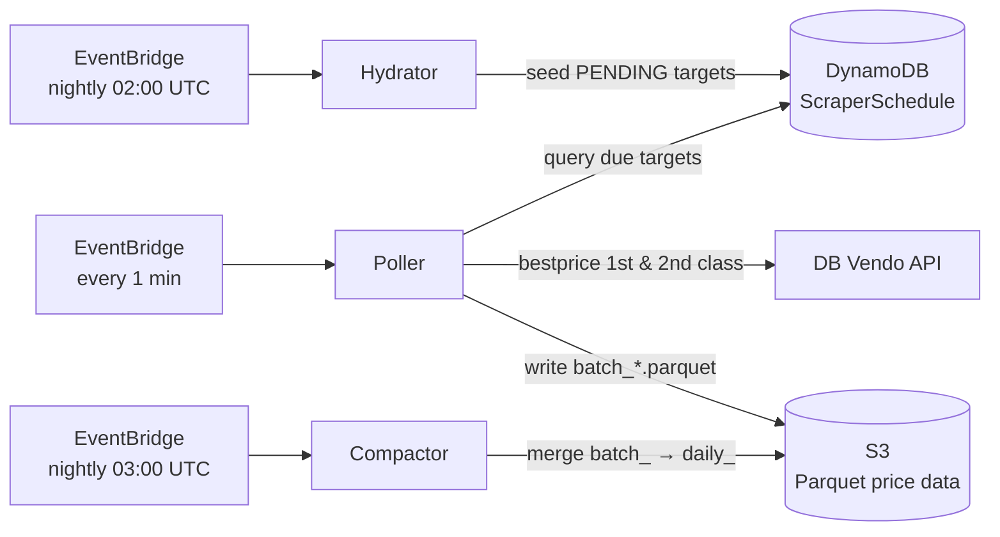

# Scraper

An independent serverless pipeline that collects, stores, and compacts Deutsche Bahn price data.
It runs alongside the main application and is deployed as a separate CDK stack (`ScraperStack`).

## Architecture



The pipeline has three Lambda functions driven by EventBridge schedules, a DynamoDB table that
tracks what to scrape and when, and an S3 bucket that stores price observations as Parquet files.

## Components

### Hydrator (`src/hydrator.ts`)

- Runs nightly at 02:00 UTC.
- Seeds the DynamoDB schedule table with scrape targets for the next N days (default: 90).
- Creates `ROUTE#{id}#DATE#{date}` items with `PENDING` status and an initial `next_scrape_at`.
- Uses conditional writes (`attribute_not_exists`) to avoid overwriting already-seeded rows.
- Assigns each target a TTD (Time-To-Departure) tier that determines scrape frequency.

### Poller (`src/poller.ts`)

- Runs every 1 minute.
- Queries the DynamoDB GSI (`ByNextScrape`) for up to 15 overdue targets.
- Makes two API calls per target to the DB Vendo bestprice endpoint (1st and 2nd class).
- Extracts journey data (price, duration, transfers, load factor) and writes Parquet to S3.
- Reschedules each target based on its updated TTD tier after a successful scrape.
- Handles rate limits (429) with a 5-minute retry backoff.
- Must run as a **Docker Lambda** (not Node.js runtime) because Akamai blocks outbound HTTP from
  AWS Node.js runtime Lambda egress IPs.

### Compactor (`src/compactor.ts`)

- Runs nightly at 03:00 UTC.
- Consolidates all `batch_*.parquet` files from the previous day into a single `daily_*.parquet`.
- Verifies row counts (Level 1: in-memory merge, Level 2: re-read + parse) before deleting originals.
- De-duplicates rows from concurrent poller invocations.
- Retains existing `daily_*` files in the merge to handle compaction retries.

### DB Vendo Client (`src/client.ts`)

- Singleton wrapper around `db-vendo-client` (Deutsche Bahn's internal timetable API).
- Custom profile normalizes nested time fields (sollzeit/istzeit) the `dbweb` endpoint returns.
- Uses the `tagesbestpreis` (bestprice) endpoint, which returns all trains for a full calendar day
  in a single call.

### TTD Tiering (`src/ttd.ts`)

| Tier   | Time to departure | Scrape interval |
| ------ | ----------------- | --------------- |
| `FAR`  | > 30 days         | 24h ±2h         |
| `MID`  | 7–30 days         | 12h ±1h         |
| `NEAR` | < 7 days          | 4h ±20min       |

### Route Catalog (`src/routes.ts`, `stations.json`)

- Two station sets: T1 (7 major German hubs) and T2 (7 secondary hubs).
- Generates all directed pairs within T1 (42 routes) and between T1↔T2 (98 routes): **140 routes**.

## Parquet Schema

S3 key layout: `prices/year={YYYY}/month={MM}/day={DD}/batch_{epoch}_{random}.parquet`

| Column              | Type        | Description                            |
| ------------------- | ----------- | -------------------------------------- |
| `observed_at`       | TIMESTAMP   | When the price was observed            |
| `service_class`     | INT32       | 1 = first class, 2 = second class      |
| `route_id`          | STRING      | `{originEva}-{destEva}`                |
| `origin_eva`        | STRING      | Origin station EVA number              |
| `origin_name`       | STRING      | Origin station name                    |
| `dest_eva`          | STRING      | Destination station EVA number         |
| `dest_name`         | STRING      | Destination station name               |
| `departure_planned` | TIMESTAMP   | Scheduled departure                    |
| `arrival_planned`   | TIMESTAMP   | Scheduled arrival                      |
| `train_type`        | STRING      | e.g. ICE, IC                           |
| `train_number`      | STRING      | Train number                           |
| `transfers`         | INT32       | Number of transfers                    |
| `duration_minutes`  | INT32       | Total journey duration                 |
| `days_to_departure` | DOUBLE      | Days between observation and departure |
| `fare_lowest_eur`   | DOUBLE      | Lowest available fare in EUR           |
| `load_factor`       | STRING/null | Capacity load factor                   |

## Build

```bash
cd scraper
npm install            # Install dependencies
npm run build          # Bundle all 3 functions with esbuild to dist/{poller,hydrator,compactor}
npm run typecheck      # TypeScript check
npm run lint           # ESLint check
```

The scraper bundles all three Lambda functions with `--format=esm` (`.mjs`). The AWS SDK packages
(`@aws-sdk/client-dynamodb`, `@aws-sdk/lib-dynamodb`, `@aws-sdk/client-s3`) are externalized since
the Node.js 24 runtime provides them. The poller bundle includes a CJS `require()` shim via banner
because `db-vendo-client`'s transitive dependency tree pulls in CJS-only modules (`qs` →
`object-inspect`) that call `require('util')` at runtime, which is unavailable in pure ESM scope.

## Local Development (Floci)

The pipeline can be run locally using [Floci](https://floci.dev/), a local AWS emulator.

```bash
docker compose up -d floci                       # Start local AWS emulator
mise run //infrastructure:deploy-local-scraper   # Build + deploy scraper stack to Floci
mise run //scraper:run-hydrator                  # Seed schedule table (3-day lookahead locally)
mise run //scraper:run-poller                    # Scrape due targets
```

The local stack uses a pinned bucket name (`scraper-data-local`) and a reduced lookahead window
(3 days) for faster iteration.

## Deployment

Deploy the scraper stack to AWS (depends on `//scraper:build`):

```bash
mise run //infrastructure:deploy-scraper
```

## Infrastructure (`ScraperStack`)

| Resource          | Details                                                      |
| ----------------- | ------------------------------------------------------------ |
| DynamoDB table    | `ScraperSchedule` — provisioned (5 RCU / 5 WCU), TTL enabled |
| S3 bucket         | Parquet price data, transitions to IA after 90 days          |
| Poller Lambda     | Docker image (ARM64, 256 MB, 60s timeout)                    |
| Hydrator Lambda   | Node.js 24 (ARM64, 128 MB, 120s timeout)                     |
| Compactor Lambda  | Node.js 24 (ARM64, 3 GB, 300s timeout)                       |
| EventBridge rules | Poller (1 min), Hydrator (02:00 UTC), Compactor (03:00 UTC)  |

## Environment Variables

| Variable                  | Description                                                  |
| ------------------------- | ------------------------------------------------------------ |
| `SCRAPER_TABLE_NAME`      | DynamoDB table for scrape schedule (injected by CDK)         |
| `SCRAPER_BUCKET_NAME`     | S3 bucket for Parquet price data (injected by CDK)           |
| `HYDRATOR_LOOKAHEAD_DAYS` | How many days ahead to seed (default: 90)                    |
| `AWS_ENDPOINT_URL`        | Local endpoint URL for Floci development (set by mise tasks) |
